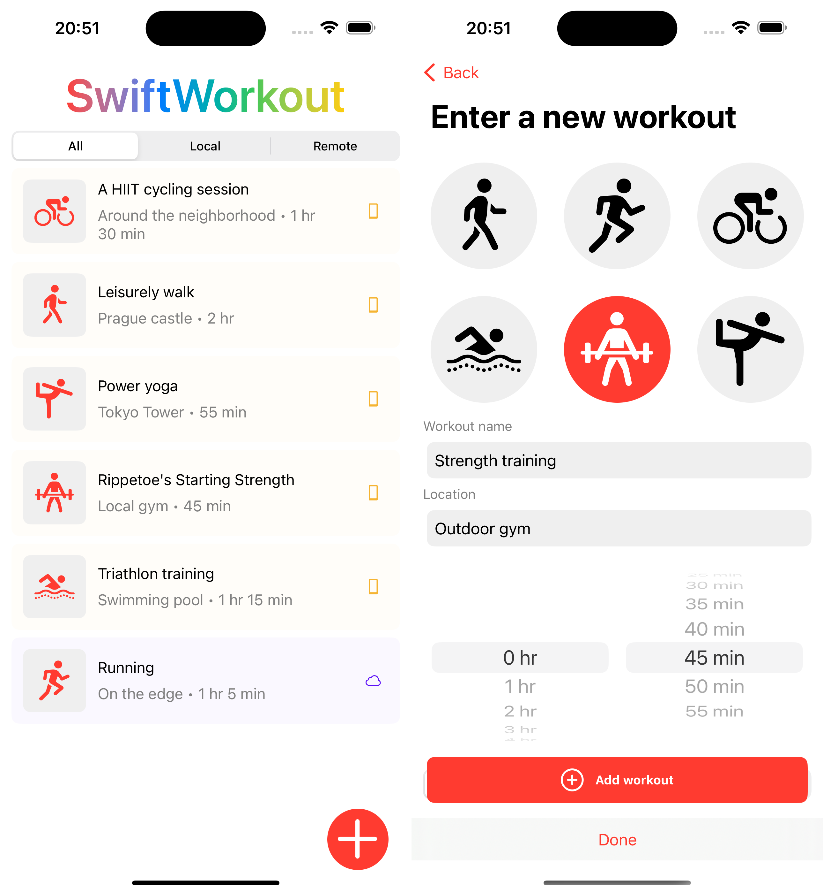

# Rationale

I've built this simple project to see how my "state of the art" architecture would look like right now. In production code I'm mostly using async/await for one-off requests and Combine for the rest, so in this project I've made the attempt to switch to swift concurrency completely including async streams.

I'm not a 100% happy with the current state; there's still a couple of `Task`s when interfacing between the Views and the VMs, and a better task cancellation (something akin to `switchToLatest`) is something I'd like to explore in further refactorings. But overall, Async streams are fast becoming a great alternative to more complex Combine chains.

As an exercise, this project is written in pure Swift with minimal dependencies, but in production I'd choose 3rd party dependencies where it makes sense (e.g. Realm/SwiftData for local storage, possibly REST/GraphQL/Firebase for remote storage, maybe [swift-dependencies](https://github.com/pointfreeco/swift-dependencies) or [Factory](https://github.com/hmlongco/Factory) for dependency management).

# The Details

- Clean Architecture
- MVVM (later I'd probably add -C as well)
- Atomic Design
- Async/await with Actors & async streams
- A simple dependency container

# UX

I've chosen a simple two-screen layout with the main screen containing the list of workouts, and the detail screen allowing the user to add or edit a workout. This is a pattern that virtually every mobile user is familiar with, which significantly decreases the learning curve. It can be found across a wide range of item-managing apps such as email clients, to-do lists, cooking apps etc.

# Tests

Tests are out of scope, but my preferred approach is a variant of the testing pyramid:
- Unit tests for the smallest units such as repositories, interactors, view models etc.
- Integrated tests for a small group of more tightly coupled components that provide some functionality that can be tested. I'm not a huge fan of integration tests.
- [Snapshot tests](https://github.com/pointfreeco/swift-snapshot-testing) for key UI elements. I try not to overdo it as snapshot tests tend to be flaky due to Xcode/simulator versioning
- UI tests where it makes sense
- E2E tests for key workflows, preferably written by a QA engineer 🙂
